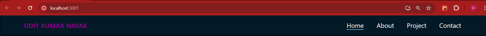

#### Navbar Component
1. Use a UL as a container
2. Have 4 LI’s
3. We will have anchor tag to make the links
4. We will use icons to render the images
5. We will create the underline effect using after
6. On hover make the underline
7. We could animate the width property of the underline to achieve the animation

#### 5 Eficiency hacks
1. Use icons
2. Use sprite
3. Use smaller images
4. Use Webp images
5. Your images should transfer in a zipper manner. Compress the image and send it to the client.

